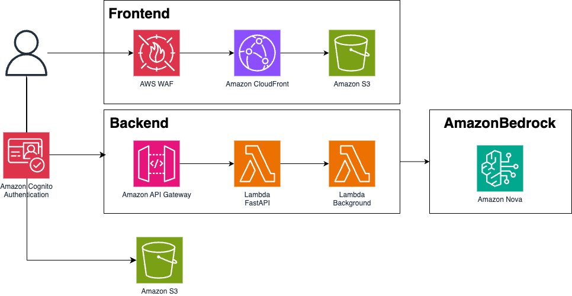

# GenAI Design Studio

日本語 | [English](./README.md)

このサンプルは、画像生成 AI (Amazon Bedrock Canvas) を活用した仮想着せ替え（ Virtual Try-On ）のソリューションです。アパレル業界やECサービスなどで洋服のデザインから実際のモデルの試着撮影までの各工程の効率化を目指しています。

## 機能

### 1. モデル生成
ボディポーズ・容姿の特徴・撮影環境などをテキストプロンプトとして指定することで仮想的なモデル画像を生成する機能です。

**主要機能:**
- **テキスト入力**: 英語・日本語など様々な言語でプロンプトによる詳細な画像描写指定
- **生成パラメータ**:
  - CFGスケール（1.1-10.0）による品質制御
  - 画像サイズ選択（1024x1024, 768x1344等）
  - 複数画像同時生成（最大5枚）

### 2. Virtual Try-On
Amazon Nova Canvas を使用したバーチャル試着機能です。1モデル生成で作成したモデル画像や既存の画像を使用して、衣服の画像のディテールを崩さずに着せ替えていくことができる。また、ジャケットの前開き/閉じやシャツのIn/Outなどの詳細も指定することができる。

**主要機能:**
- **画像指定**: モデル画像、衣服画像、（マスク画像）
- **マスクタイプ**:
  - `GARMENT`: 衣服タイプ自動検出（上半身、下半身、全身等）
  - `PROMPT`: テキストプロンプトによるマスク領域指定
  - `IMAGE`: カスタムマスク画像によるピンポイント指定
- **ペイントエディタ**: 描画ツールを使用してモデル画像の上からマスク画像を作成
- **詳細パラメータ**:
  - 衣服クラス（18種類）、スタイル設定（袖、裾、アウター等）
  - ボディポーズ・手・顔の保持設定
  - マージスタイル（Balanced/Seamless/Detailed）
- **生成設定**: 複数画像生成（最大5枚）、品質選択、CFGスケール調整

### 3. 背景置換
2Virtual Try-On で生成したモデル画像の背景を、テキストプロンプトとして指定することで自然に置き換える機能です。

**主要機能:**
- **背景プロンプト**: 英語・日本語など様々な言語で背景の詳細描写指定（最大1024文字）
- **マスク制御**:
  - マスクプロンプト（人物保護等）
  - カスタムマスク画像によるピンポイント保護
- **OutPainting Mode**:
  - `DEFAULT`: 標準的な背景置換
  - `PRECISE`: 高精度な境界処理
- **詳細設定**: CFGスケール、画像サイズ選択、複数画像生成

### 管理機能
- **ユーザーログイン**: Amazon Cognito User Pool によるユーザー管理
- **アクセス制限**: アクセス元IPや登録ユーザーメールのドメイン名制御
- **セルフサインナップ機能**: アプリでのユーザー登録機能の有効/無効制御


## 活用ユースケース
### テストマーケティング
洋服の商用販売前に複数のサンプルバリエーションの画像を用意して、Virtual Try-On 機能によりモデルが着た画像を生成しSNSなどでテストマーケティングを行う。
### ユニフォーム提案
スポーツチームユニフォームや学校制服など顧客提案時に、Virtual Try-On 機能により生成した画像を使ってより具体的な提案を行う。
### プランニング
撮影前に複数のサンプルバリエーションで Virtual Try-On を試し、それぞれの服にあったモデル、撮影場所、パンツとジャケットの組み合わせなどを選定していく。

## Deploy
[DEPLOYMENTドキュメント](./docs/ja/DEPLOYMENT.md)を参考にAWS環境へのデプロイを実行してください。

## アーキテクチャ


- **Frontend**: React + Vite + TypeScript + MUI
- **Backend API**: FastAPI (Lambda) + Amazon Cognito認証
- **Image Generation**: Python Lambda + Amazon Nova Canvas
- **Infrastructure**: AWS CDK (TypeScript)
- **Storage**: Amazon S3
- **Security**: AWS WAF + Amazon Cognito
- **Authentication**: AWS Cognito + JWT

## プロジェクト構造

```
vto-app/
├── frontend/               # React フロントエンドアプリケーション
│   ├── src/               # ソースコード
│   │   ├── components/    # React コンポーネント
│   │   ├── pages/         # ページコンポーネント
│   │   ├── auth/          # 認証関連
│   │   ├── contexts/      # Reactコンテキスト
│   │   ├── hooks/         # カスタムフック
│   │   ├── stores/        # 状態管理
│   │   ├── utils/         # ユーティリティ
│   │   └── __tests__/     # テストファイル
│   ├── public/            # 静的ファイル
│   ├── test/              # テスト設定
│   │   └── test_setup.zsh              # テスト実行スクリプト
│   └── package.json       # Node.js依存関係
├── lambda/                # Lambda関数群
│   ├── api/               # FastAPI アプリケーション
│   │   ├── app/           # アプリケーションコード
│   │   │   ├── main.py                  # FastAPIメインアプリ
│   │   │   ├── auth/                    # 認証関連
│   │   │   ├── routes/                  # APIルート
│   │   │   ├── routes/schemas/          # APIスキーマ
│   │   │   └── utils/                   # 共通ユーティリティ
│   │   ├── Dockerfile                   # 本番用Dockerfile
│   │   ├── Dockerfile.dev               # 開発用Dockerfile
│   │   └── requirements.txt             # Python依存関係
│   ├── gen_vto_image/     # 画像生成Lambda（非同期処理）
│   │   ├── index.py                     # Lambdaエントリポイント
│   │   ├── utils/                       # 画像生成ユーティリティ
│   │   └── requirements.txt             # Python依存関係
│   ├── cognito_triggers/  # Cognito Lambda トリガー
│   │   └── pre_sign_up/   # プレサインアップトリガー
│   └── test/              # テストファイル
├── cdk/                   # AWS CDKインフラストラクチャ
│   ├── bin/               # CDKアプリケーションエントリポイント
│   │   └── vto-app.ts                   # CDKメインエントリ
│   ├── lib/               # CDKスタック定義
│   │   ├── vto-app-stack.ts             # メインスタック
│   │   ├── frontend-waf-stack.ts        # WAFスタック（us-east-1）
│   │   └── constructs/                  # CDK構成要素
│   ├── cdk.json           # CDK設定
│   └── package.json       # Node.js依存関係
├── docs/                  # ドキュメント
├── img/                   # ドキュメント用画像
```


## コントリビューション

[CONTRIBUTING](./CONTRIBUTING.md)をご確認ください。

## ライセンス

本プロジェクトは [LICENSE](./LICENSE) に記載されたライセンスの下で配布されています。
