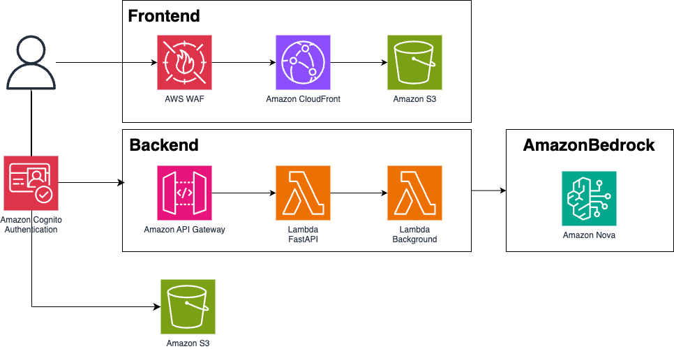

# GenAI Design Studio

[日本語](./README.ja.md) | English

This sample is a Virtual Try-On solution leveraging image generation AI (Amazon Bedrock Canvas). It aims to improve efficiency in various processes from clothing design to actual model fitting photography in the apparel industry and e-commerce services.

## Features

### 1. Model Generation
A feature that generates virtual model images by specifying body pose, appearance characteristics, and shooting environment as text prompts.

**Key Features:**
- **Text Input**: Detailed image description specification through prompts in various languages including English and Japanese
- **Generation Parameters**:
  - Quality control through CFG Scale (1.1-10.0)
  - Image size selection (1024x1024, 768x1344, etc.)
  - Multiple image simultaneous generation (up to 5 images)

### 2. Virtual Try-On
Virtual try-on functionality using Amazon Nova Canvas. You can use model images created in 1. Model Generation or existing images to dress up while maintaining the details of clothing images. You can also specify details such as jacket open/closed and shirt in/out.

**Key Features:**
- **Image Specification**: Model image, garment image, (mask image)
- **Mask Types**:
  - `GARMENT`: Automatic garment type detection (upper body, lower body, full body, etc.)
  - `PROMPT`: Mask area specification through text prompts
  - `IMAGE`: Pinpoint specification through custom mask images
- **Paint Editor**: Create mask images using drawing tools over model images
- **Detailed Parameters**:
  - Garment class (18 types), style settings (sleeves, hem, outer, etc.)
  - Body pose, hand, and face preservation settings
  - Merge style (Balanced/Seamless/Detailed)
- **Generation Settings**: Multiple image generation (up to 5 images), quality selection, CFG scale adjustment

### 3. Background Replacement
A feature that naturally replaces the background of model images generated in 2. Virtual Try-On by specifying them as text prompts.

**Key Features:**
- **Background Prompt**: Detailed background description specification in various languages including English and Japanese (up to 1024 characters)
- **Mask Control**:
  - Mask prompt (person protection, etc.)
  - Pinpoint protection through custom mask images
- **OutPainting Mode**:
  - `DEFAULT`: Standard background replacement
  - `PRECISE`: High-precision boundary processing
- **Detailed Settings**: CFG scale, image size selection, multiple image generation

### Management Features
- **User Login**: User management through Amazon Cognito User Pool
- **Access Control**: Control of source IP and registered user email domain names
- **Self Sign-up Feature**: Enable/disable control of user registration functionality in the app

## Use Cases
### Test Marketing
Prepare multiple sample variation images before commercial sales of clothing, generate images of models wearing them using Virtual Try-On functionality, and conduct test marketing on social media platforms.
### Uniform Proposals
For sports team uniforms or school uniforms, use Virtual Try-On generated images during client proposals to provide more concrete presentations.
### Planning
Before photography, try Virtual Try-On with multiple sample variations to select appropriate models, shooting locations, and combinations of pants and jackets for each garment.

## Deploy
Please refer to the [DEPLOYMENT document](./docs/en/DEPLOYMENT.md) to execute deployment to AWS environment.

## Architecture


- **Frontend**: React + Vite + TypeScript + MUI
- **Backend API**: FastAPI (Lambda) + Amazon Cognito Authentication
- **Image Generation**: Python Lambda + Amazon Nova Canvas
- **Infrastructure**: AWS CDK (TypeScript)
- **Storage**: Amazon S3
- **Security**: AWS WAF + Amazon Cognito
- **Authentication**: AWS Cognito + JWT

## Project Structure

```
vto-app/
├── frontend/               # React frontend application
│   ├── src/               # Source code
│   │   ├── components/    # React components
│   │   ├── pages/         # Page components
│   │   ├── auth/          # Authentication related
│   │   ├── contexts/      # React contexts
│   │   ├── hooks/         # Custom hooks
│   │   ├── stores/        # State management
│   │   ├── utils/         # Utilities
│   │   └── __tests__/     # Test files
│   ├── public/            # Static files
│   ├── test/              # Test configuration
│   │   └── test_setup.zsh              # Test execution script
│   └── package.json       # Node.js dependencies
├── lambda/                # Lambda functions
│   ├── api/               # FastAPI application
│   │   ├── app/           # Application code
│   │   │   ├── main.py                  # FastAPI main app
│   │   │   ├── auth/                    # Authentication related
│   │   │   ├── routes/                  # API routes
│   │   │   ├── routes/schemas/          # API schemas
│   │   │   └── utils/                   # Common utilities
│   │   ├── Dockerfile                   # Production Dockerfile
│   │   ├── Dockerfile.dev               # Development Dockerfile
│   │   └── requirements.txt             # Python dependencies
│   ├── gen_vto_image/     # Image generation Lambda (asynchronous processing)
│   │   ├── index.py                     # Lambda entry point
│   │   ├── utils/                       # Image generation utilities
│   │   └── requirements.txt             # Python dependencies
│   ├── cognito_triggers/  # Cognito Lambda triggers
│   │   └── pre_sign_up/   # Pre sign-up trigger
│   └── test/              # Test files
├── cdk/                   # AWS CDK infrastructure
│   ├── bin/               # CDK application entry point
│   │   └── vto-app.ts                   # CDK main entry
│   ├── lib/               # CDK stack definitions
│   │   ├── vto-app-stack.ts             # Main stack
│   │   ├── frontend-waf-stack.ts        # WAF stack (us-east-1)
│   │   └── constructs/                  # CDK constructs
│   ├── cdk.json           # CDK configuration
│   └── package.json       # Node.js dependencies
├── docs/                  # Documentation
├── img/                   # Documentation images
```

## Contributing

Please check [CONTRIBUTING](./CONTRIBUTING.md).

## License

This project is licensed under the MIT-0 License. Please check [LICENSE](./LICENSE).
