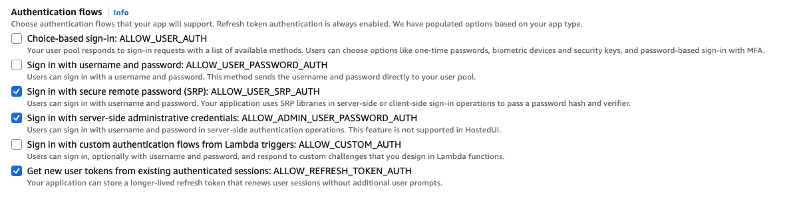

# Backend Development Guide

## Overview

This document explains backend development and testing for the VTO application.
Testing includes the following two main components:

1. **Nova VTO API** - RESTful API built with FastAPI
2. **gen_vto_image Lambda Function** - Image generation Lambda function using Amazon Bedrock

### Recommended Test Execution Flow

#### 1. Local Test Execution
First, execute tests in the local environment to verify basic functionality.

#### 2. CDK Deploy
After local tests complete successfully, deploy AWS resources.

#### 3. Remote Test Execution
After deployment, execute tests in the production environment for final verification.

## Backend API Endpoints

### Authentication Endpoints
- `POST /auth/login` - User login
- `POST /auth/logout` - User logout
- `POST /auth/refresh` - Token refresh
- `GET /auth/user` - User information retrieval

### VTO Processing Endpoints
- `POST /nova-vto/process` - Start VTO processing
- `GET /nova-vto/status/{request_id}` - Check processing status
- `GET /nova-vto/result/{request_id}` - Get processing results

### Model Generation Endpoints
- `POST /nova-model/generate` - Model image generation
- `GET /nova-model/status/{request_id}` - Check generation status

### Background Replacement Endpoints
- `POST /background-replacement/process` - Background replacement processing

### Utility Endpoints
- `GET /health` - Health check
- `POST /utils/upload-url` - S3 upload URL retrieval

## 1. Nova VTO API Test

### Local API Test

#### Execution Method
```bash
cd vto-app/lambda/test/
local_api_test.zsh
```

#### Overview
- **Purpose**: Start FastAPI development server in Docker container and test API functionality
- **Docker Image**: `vto-api-dev`
- **Port**: 8000
- **Test Target**: All endpoints of Nova VTO API

#### Execution Steps
1. **AWS Credentials Setup**: Set AWS credentials using `isengardcli credentials`
2. **S3 Bucket Creation**: Create test S3 bucket `vto-app-{ACCOUNT_ID}`
3. **CORS Configuration**: Add CORS configuration to S3 bucket
4. **Docker Container Startup**: Start FastAPI application in container
5. **API Test Execution**: Execute `test_nova_vto_api.py` to test API functionality
6. **Cleanup**: Stop and delete container after test completion

#### Main Parameters
- `IMAGE_NAME`: vto-api-dev
- `CONTAINER_NAME`: vto-api-test
- `PORT`: 8000
- `MAX_WAIT_TIME`: 30 seconds (API startup wait time)

#### Test Content
- Health check
- Object name generation
- Presigned URL generation (upload/download)
- Image upload/download
- Nova VTO processing workflow
- Nova Model image generation workflow

### Remote API Test

#### Execution Method
```bash
cd vto-app/lambda/test/

# First execution (create new user)
lambda_api_test.zsh --username testuser --password Password123! --first-run

# Subsequent executions (token refresh)
lambda_api_test.zsh --username testuser --password Password123!

# Execute specific test only
lambda_api_test.zsh --username testuser --password Password123! test_health_check
```

#### Overview
- **Purpose**: Execute tests against deployed API Gateway endpoints
- **Parameter Acquisition**: Automatically acquire API URL, S3 bucket name, Cognito information from CDK output file `.cdk-outputs.json`
- **Authentication Function**: API access using Cognito authentication
- **Remote Mode**: `--remote` flag enabled by default

#### Prerequisites
- CDK deployment completed
- `.cdk-outputs.json` file exists
- `jq` command installed
- Cognito UserPool and Client configured

#### Cognito Authentication Configuration

##### Enable ALLOW_ADMIN_USER_PASSWORD_AUTH Authentication Flow
To ensure test scripts work properly, specific authentication flows must be enabled.

**Authentication Flow Configuration Method**:
1. Access Amazon Cognito > User pools > VtoAppStack-user-pool > App clients
2. Select App client: VtoAppStack-client
3. Click "Edit app client information"
4. Enable `ALLOW_ADMIN_USER_PASSWORD_AUTH` in Authentication flows



> **⚠️ Important Note**: Use `ALLOW_ADMIN_USER_PASSWORD_AUTH` only for development environment testing purposes. For production environments, using the more secure `ALLOW_USER_SRP_AUTH` is recommended.

#### Authentication Parameters
- `--username`: Username for Cognito authentication (required)
- `--password`: Password for Cognito authentication (required)
- `--first-run`: First execution flag (used when creating new user)
- `--cdk-outputs`: CDK output file path (default: `../cdk/.cdk-outputs.json`)

#### Execution Steps
1. **CDK Output Verification**: Extract API URL, S3 bucket name, Cognito information from `.cdk-outputs.json`
2. **Parameter Validation**: Check if extracted parameters are valid
3. **Authentication Setup**: Authenticate with Cognito username and password
4. **Remote Test Execution**: Execute `test_nova_vto_api.py --remote` (with authentication headers)
5. **Result Verification**: Download and verify generated images

#### Main Parameters
- `API_URL`: API Gateway URL acquired from CDK output
- `BUCKET_NAME`: S3 bucket name acquired from CDK output
- `USER_POOL_ID`: Cognito UserPool ID acquired from CDK output
- `CLIENT_ID`: Cognito Client ID acquired from CDK output
- `--remote`: Remote mode flag (enables generated image download testing)

#### Authentication Flow
1. **First execution (--first-run)**:
   - Create Cognito user with specified username and password
   - Set password (change from temporary password to permanent password)
   - Acquire authentication token and save to `.apiconfig.json`

2. **Subsequent executions**:
   - Load refresh token from saved `.apiconfig.json`
   - Acquire new ID token using refresh token
   - Execute API requests with updated token

#### Authentication Error Handling
- If user already exists, attempt login with specified password
- If token expired, refresh using refresh token
- If authentication fails, execute test without authentication (some tests may fail)

---

## 2. gen_vto_image Lambda Function Test

### Local Lambda Test

#### Execution Method
```bash
cd vto-app/lambda/test/
local_vto_test.zsh
```

#### Overview
- **Purpose**: Local Lambda execution test using Lambda Runtime Interface Emulator (RIE)
- **Docker Image**: `gen-vto-image-test`
- **Port**: 9000 (Lambda RIE)
- **Base Image**: `public.ecr.aws/lambda/python:3.13`

#### Execution Steps
1. **AWS Credentials Setup**: Set AWS credentials and S3 bucket
2. **Docker Image Build**: Build using `Dockerfile.gen_vto_image`
3. **Lambda RIE Startup**: Start Lambda function in container
4. **Test Execution**: Test Lambda function with `test_gen_vto_image.py`
5. **Result Save**: Save generated images to `test_data/output/local/`
6. **Cleanup**: Stop and delete container

#### Main Parameters
- `IMAGE_NAME`: gen-vto-image-test
- `CONTAINER_NAME`: gen-vto-image-rie
- `PORT`: 9000
- `MAX_WAIT_TIME`: 30 seconds (Lambda RIE startup wait time)

### Remote Lambda Test

#### Execution Method
```bash
cd vto-app/lambda/test/
lambda_vto_test.zsh
```

#### Overview
- **Purpose**: Direct invocation test against deployed Lambda function
- **AWS SDK**: Direct Lambda function execution using boto3
- **Parameter Acquisition**: Automatically acquire Lambda function name from CDK output

#### Prerequisites
- CDK deployment completed
- `boto3` installed
- AWS credentials configured
- Lambda function execution permissions available

#### Execution Steps
1. **AWS Authentication Verification**: Verify authentication status with `aws sts get-caller-identity`
2. **CDK Output Loading**: Acquire Lambda function name and S3 bucket name
3. **Lambda Function Verification**: Verify function existence with `aws lambda get-function`
4. **Remote Test Execution**: Execute `test_gen_vto_image.py --mode remote`
5. **Result Save**: Save generated images to `test_data/output/remote/`

#### Main Parameters
- `LAMBDA_FUNCTION_NAME`: Lambda function name acquired from CDK output
- `VTO_BUCKET`: S3 bucket name acquired from CDK output
- `--mode remote`: Remote execution mode flag
- `--region us-east-1`: AWS region specification

---

## 3. Test Script Details

### test_nova_vto_api.py

#### Test Class: NovaVTOAPITest

##### Main Test Methods

**1. test_health_check**
- **Purpose**: Test API health check endpoint
- **Endpoint**: `GET /health`
- **Verification Items**: 
  - Status code 200
  - Response format `{"status": "healthy", "message": "..."}`

**2. test_generate_object_names**
- **Purpose**: Test object name generation functionality
- **Endpoint**: `GET /utils/get/objectname`
- **Parameters**: `seller_id`, `item_id`
- **Verification Items**: 
  - Verify generation of `date_folder`, `timestamp`, `uid`
  - Each field is string and not empty

**3. test_presigned_upload_url / test_presigned_download_url**
- **Purpose**: Test S3 presigned URL generation functionality
- **Endpoint**: `POST /utils/s3url/upload`, `POST /utils/s3url/download`
- **Parameters**: `object_name`, `expiration`
- **Verification Items**: 
  - Verify presigned URL generation
  - No errors

**4. test_image_upload_via_presigned_url / test_image_download_via_presigned_url**
- **Purpose**: Test image upload/download using presigned URLs
- **Test Files**: `test_data/input/model.png`, `test_data/input/garment.png`
- **Verification Items**: 
  - Normal image upload
  - Normal download of uploaded images

**5. test_nova_vto_workflow**
- **Purpose**: Complete workflow test for Nova VTO processing
- **Endpoint**: `POST /vto/nova/process`
- **Steps**:
  1. Object name generation
  2. Test image upload
  3. VTO processing execution
  4. Generated image download (remote mode only)
- **Verification Items**: 
  - Request acceptance confirmation (`status: "accepted"`)
  - `object_names` generation confirmation

**6. test_nova_vto_with_mask_image**
- **Purpose**: VTO processing test using mask image
- **Mask Type**: `IMAGE`
- **Test File**: `test_data/input/mask.png`
- **Execution Condition**: Remote mode only
- **Verification Items**: Normal execution of VTO processing including mask image

**7. test_nova_model_text_to_image**
- **Purpose**: Test text-to-image generation using Nova Model
- **Endpoint**: `POST /vto/nova/model`
- **Parameters**: `prompt`, `model_id`, `cfg_scale`, `height`, `width`
- **Verification Items**: Verify image generation from text prompt

**8. test_nova_model_{custom_params, three_images, four_images_error}**
- **Purpose**: Various parameter tests for Nova Model
- **Test Content**:
  - Image generation with custom parameters
  - 3 image simultaneous generation (limit value)
  - 4 image generation error case (exceeding limit)

**9. Error Case Tests**
- `test_nova_vto_missing_required_fields`: Validation error when required fields missing
- `test_nova_model_missing_prompt`: Error when prompt missing
- `test_nova_model_missing_required_fields`: Error when Nova Model required fields missing

##### Class Variables & Configuration

- `base_url`: API base URL (default: `http://localhost:8000`)
- `bucket_name`: S3 bucket name
- `remote`: Remote test mode flag
- `seller_id`: Test seller ID (`test_seller_001`)
- `item_id`: Test item ID (`test_item_001`)

### test_gen_vto_image.py

#### Test Class: GenVTOImageTest

##### Main Test Methods

**1. VTO Processing Tests**

**test_basic_vto_processing**
- **Purpose**: Test basic VTO image processing
- **Input**: S3 object names (`source_image`, `reference_image`)
- **Parameters**: 
  - `mask_type: "GARMENT"`
  - `garment_class: "UPPER_BODY"`
  - `number_of_images: 1`
  - `quality: "standard"`
  - `cfg_scale: 3.0`
- **Output**: `test_data/output/{mode}/vto_img_test/gen_vto_result_*.png`

**test_vto_with_prompt_mask**
- **Purpose**: VTO processing using prompt-based mask
- **Mask Type**: `PROMPT`
- **Mask Prompt**: `"upper body clothing"`
- **Seed Value**: 42 (for reproducibility)
- **Output**: `test_data/output/{mode}/vto_img_test/gen_vto_prompt_mask_*.png`

**test_vto_with_return_mask**
- **Purpose**: Test mask image return functionality
- **Parameters**: `return_mask: True`
- **Verification Items**: 
  - Generated image verification
  - Mask image return verification
- **Output**: 
  - Images: `gen_vto_with_mask_*.png`
  - Masks: `gen_vto_mask_*.png`

**test_vto_with_image_mask**
- **Purpose**: VTO processing using custom mask image
- **Mask Type**: `IMAGE`
- **Input**: `mask_image_object_name`
- **Seed Value**: 42
- **Output**: `gen_vto_image_mask_*.png`

**test_vto_with_four_images**
- **Purpose**: Test 4 image simultaneous generation
- **Parameters**: `number_of_images: 4`
- **Seed Value**: 42
- **Verification Items**: Verify exactly 4 images are generated
- **Output**: `gen_vto_four_images_*.png`

**2. Text-to-Image Generation Tests**

**test_text_to_image_generation**
- **Purpose**: Test basic text-to-image generation
- **Prompt**: `"A beautiful landscape with mountains and a lake"`
- **Model**: `amazon.titan-image-generator-v2:0`
- **Parameters**: 
  - `cfg_scale: 8.0`
  - `height: 1024, width: 1024`
  - `number_of_images: 1`
- **Output**: `test_data/output/{mode}/text_to_image_test/text_to_image_result_*.png`

**test_text_to_image_generation_japanese**
- **Purpose**: Image generation test with Japanese prompt
- **Prompt**: `"美しい女性のモデルが撮影スタジオでポージングしている。白背景にモデルの全身が映っていて、正面を向いて立っている。モデルは美しい赤いワンピースをきている"`
- **Output**: `text_to_image_japanese_result_*.png`

**test_text_to_image_generation_english**
- **Purpose**: Image generation test with English prompt (for comparison with Japanese version)
- **Prompt**: `"A beautiful female model is posing in a photography studio. Her whole body is visible against a white background, standing and facing forward. The model is wearing a beautiful red dress."`
- **Output**: `text_to_image_english_result_*.png`

**test_text_to_image_with_custom_params**
- **Purpose**: Image generation test with custom parameters
- **Prompt**: `"A futuristic city with flying cars and neon lights"`
- **Parameters**: 
  - `cfg_scale: 10.0` (high value)
  - `height: 512, width: 512` (different size)
  - `number_of_images: 3` (multiple images)
- **Output**: `text_to_image_custom_*.png`

**test_text_to_image_with_s3_save**
- **Purpose**: Image generation test including S3 save functionality
- **Parameters**: Specify `object_names` to enable S3 save
- **Verification Items**: 
  - Image generation verification
  - S3 URL return verification (when available)
- **Output**: `text_to_image_s3_save_*.png`

**3. Error Handling Tests**

**test_invalid_event_structure**
- **Purpose**: Error handling for invalid event structure
- **Input**: `{"invalid_key": "invalid_value"}` (without `vto_params`)
- **Expected Result**: Status code 400, error message return

**test_missing_required_images**
- **Purpose**: Error handling when required images missing
- **Input**: Omit `source_image` and `reference_image`
- **Expected Result**: Status code 500, error message return

**test_text_to_image_missing_prompt**
- **Purpose**: Error handling when prompt missing
- **Input**: Omit prompt in `text_to_image_params`
- **Expected Result**: Status code 400, `"Prompt is required"` error

##### Test Mode Configuration

**Local Mode (`test_mode = "local"`)**
- **Lambda RIE URL**: `http://localhost:9000/2015-03-31/functions/function/invocations`
- **Execution Method**: Call Lambda RIE via HTTP POST request
- **Health Check**: Verify RIE response with simple test event

**Remote Mode (`test_mode = "remote"`)**
- **AWS SDK**: Direct Lambda function invocation using boto3
- **Function Name**: Acquired from CDK output or fallback value
- **Execution Method**: Execute Lambda function with `lambda_client.invoke()`
- **Health Check**: Simple invocation to actual Lambda function

##### S3 Integration

**Test Image Upload**
- **Method**: `_upload_test_images_to_s3()`
- **Target Files**: 
  - `test_data/input/model.png` → `test/input/model.png`
  - `test_data/input/garment.png` → `test/input/garment.png`
  - `test_data/input/mask.png` → `test/input/mask.png`
- **Execution Timing**: During test class initialization

**Image Conversion Utilities**
- `_image_to_base64()`: Base64 encode image files
- `_base64_to_image()`: Save Base64 strings to image files
- **Usage**: Image data transmission/reception with Lambda

---

## 4. Execution Command Reference

### Complete Test Flow
```bash
# 1. Local test execution
cd vto-app/lambda/test

# API local test
local_api_test.zsh

# Lambda local test  
local_vto_test.zsh

# 2. CDK deployment
cd ../cdk
npx cdk deploy --all --require-approval never --outputs-file ./.cdk-outputs.json

# 3. Remote test execution
cd ../test

# API remote test
lambda_api_test.zsh

# Lambda remote test
lambda_vto_test.zsh
```

### Individual Test Execution
```bash
# API test (local)
python3 test_nova_vto_api.py --base-url http://localhost:8000 --bucket-name test-bucket

# API test (remote)
python3 test_nova_vto_api.py --base-url https://api.example.com --bucket-name prod-bucket --remote

# Lambda test (local)
python3 test_gen_vto_image.py --mode local

# Lambda test (remote)
python3 test_gen_vto_image.py --mode remote --region us-east-1

# Execute specific test only
python3 test_gen_vto_image.py --mode local GenVTOImageTest.test_basic_vto_processing
