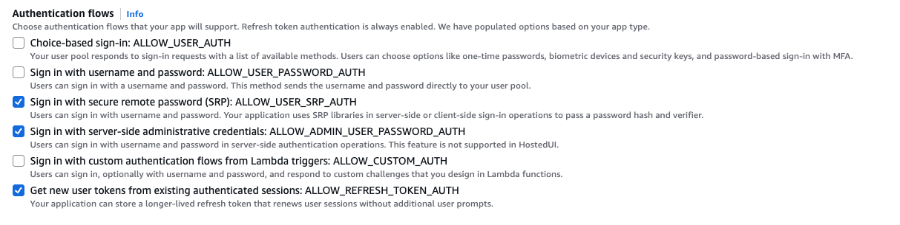

# バックエンド開発ガイド

## 概要

このドキュメントでは、VTOアプリケーションのバックエンド開発及びテストについて説明します。
テストには以下の2つの主要なコンポーネントが含まれます：

1. **Nova VTO API** - FastAPIで構築されたRESTful API
2. **gen_vto_image Lambda Function** - Amazon Bedrockを使用した画像生成Lambda関数

## バックエンド API エンドポイント

### ヘルスチェックエンドポイント
- `GET /` - ルートエンドポイント（ヘルスチェック）
- `GET /health` - ヘルスチェックエンドポイント

### VTO処理エンドポイント
- `POST /vto/nova/process` - Nova Canvas VTO処理を開始

### モデル生成エンドポイント
- `POST /vto/nova/model` - Nova Model テキストから画像生成

### 背景置換エンドポイント
- `POST /vto/nova/background` - Nova Canvas 背景置換処理

### ユーティリティエンドポイント
- `GET /utils/get/objectname` - S3オブジェクト名生成
- `POST /utils/s3url/upload` - S3アップロード用プリサインドURL取得
- `POST /utils/s3url/download` - S3ダウンロード用プリサインドURL取得
- 

## 推奨テスト実行フロー

### 事前準備
1. **AWS認証情報設定**: 以下のように、AWS認証情報を設定
```
export AWS_ACCESS_KEY_ID=XXXXX
export AWS_SECRET_ACCESS_KEY=YYYYY
export AWS_SESSION_TOKEN=ZZZZZZ
```

### 1. ローカルテスト実行
まず、ローカル環境でテストを実行して基本的な動作を確認します。

### 2. CDK Deploy
ローカルテストが正常に完了したら、AWSリソースをデプロイします。

### 3. リモートテスト実行
デプロイ後、本番環境でテストを実行して最終確認を行います。


## 1. Nova VTO API テスト

### ローカルAPIテスト

#### 実行方法
```bash
cd lambda/test/
./local_api_test.zsh
```

#### 概要
- **目的**: FastAPI開発サーバーをDockerコンテナで起動し、API機能をテスト
- **Docker Image**: `vto-api-dev`
- **ポート**: 8000
- **テスト対象**: Nova VTO API の全エンドポイント

#### 実行内容
1. **S3バケット作成**: テスト用S3バケット `vto-app-{ACCOUNT_ID}` を作成
1. **CORS設定**: S3バケットにCORS設定を追加
1. **Dockerコンテナ起動**: FastAPIアプリケーションをコンテナで起動
1. **APIテスト実行**: `test_nova_vto_api.py` を実行してAPI機能をテスト
1. **クリーンアップ**: テスト完了後、コンテナを停止・削除

#### 主要パラメータ
- `IMAGE_NAME`: vto-api-dev
- `CONTAINER_NAME`: vto-api-test
- `PORT`: 8000
- `MAX_WAIT_TIME`: 30秒（API起動待機時間）

#### テスト内容
- ヘルスチェック
- オブジェクト名生成
- プリサインドURL生成（アップロード/ダウンロード）
- 画像アップロード・ダウンロード
- Nova VTO処理ワークフロー
- Nova Model画像生成ワークフロー

### リモートAPIテスト

#### 実行方法
```bash
cd lambda/test/

# 初回実行（新規ユーザー作成）
./lambda_api_test.zsh --username your_email --password Password123! --first-run

# 2回目以降の実行（トークン更新）
./lambda_api_test.zsh --username your_email --password Password123!

# 特定のテストのみ実行
./lambda_api_test.zsh --username your_email --password Password123! test_health_check
```

#### 概要
- **目的**: デプロイされたAPI Gatewayエンドポイントに対してテストを実行
- **パラメータ取得**: CDK出力ファイル `.cdk-outputs.json` からAPI URL、S3バケット名、Cognito情報を自動取得
- **認証機能**: Cognito認証を使用してAPIアクセス
- **リモートモード**: デフォルトで `--remote` フラグが有効

#### 前提条件
- CDK デプロイが完了していること
- `.cdk-outputs.json` ファイルが存在すること
- `jq` コマンドがインストールされていること
- Cognito UserPoolとClientが設定されていること

#### Cognito認証設定

##### ALLOW_ADMIN_USER_PASSWORD_AUTH 認証フローの有効化
テストスクリプトが正常に動作するためには、特定の認証フローを有効にする必要があります。

**認証フロー設定方法**:
1. Amazon Cognito > User pools > VtoAppStack-user-pool > App clients にアクセス
2. App client: VtoAppStack-client を選択
3. "Edit app client information" をクリック
4. Authentication flows で `ALLOW_ADMIN_USER_PASSWORD_AUTH` を有効化



> **⚠️ 重要な注意**: `ALLOW_ADMIN_USER_PASSWORD_AUTH` は開発環境でのテスト用途にのみ使用してください。プロダクション環境では、より安全な `ALLOW_USER_SRP_AUTH` の使用を推奨します。

#### 認証パラメータ
- `--username`: Cognito認証用のユーザー名となるメールアドレス（必須）
- `--password`: Cognito認証用のパスワード（必須）
- `--first-run`: 初回実行フラグ（新規ユーザー作成時に使用）
- `--cdk-outputs`: CDK出力ファイルのパス（デフォルト: `../cdk/.cdk-outputs.json`）

#### 実行手順
1. **CDK出力確認**: `.cdk-outputs.json` からAPI URL、S3バケット名、Cognito情報を抽出
2. **パラメータ検証**: 抽出したパラメータが有効かチェック
3. **認証設定**: Cognitoユーザー名とパスワードで認証
4. **リモートテスト実行**: `test_nova_vto_api.py --remote` を実行（認証ヘッダー付き）
5. **結果確認**: 生成された画像をダウンロードして検証

#### 主要パラメータ
- `API_URL`: CDK出力から取得されるAPI Gateway URL
- `BUCKET_NAME`: CDK出力から取得されるS3バケット名
- `USER_POOL_ID`: CDK出力から取得されるCognito UserPool ID
- `CLIENT_ID`: CDK出力から取得されるCognito Client ID
- `--remote`: リモートモードフラグ（生成画像のダウンロードテストを有効化）

#### 認証フロー
1. **初回実行時（--first-run）**:
   - 指定されたユーザー名とパスワードでCognitoユーザーを作成
   - パスワードを設定（一時パスワードから本パスワードへ変更）
   - 認証トークンを取得して`.apiconfig.json`に保存

2. **2回目以降の実行**:
   - 保存された`.apiconfig.json`からリフレッシュトークンを読み込み
   - リフレッシュトークンを使用して新しいIDトークンを取得
   - 更新されたトークンでAPIリクエストを実行

#### 認証エラーの対処
- ユーザーが既に存在する場合は、指定されたパスワードでログイン試行
- トークンの有効期限切れの場合は、リフレッシュトークンで更新
- 認証失敗時は、認証なしでテストを実行（一部のテストは失敗する可能性）

---

## 2. gen_vto_image Lambda Function テスト

### ローカルLambdaテスト

#### 実行方法
```bash
cd lambda/test/
local_vto_test.zsh
```

#### 概要
- **目的**: ローカルLambda実行テスト
- **Docker Image**: `gen-vto-image-test`
- **ポート**: 9000（Lambda RIE）
- **Base Image**: `public.ecr.aws/lambda/python:3.13`

#### 実行手順
1. **AWS認証情報設定**: AWS認証情報とS3バケットを設定
2. **Dockerイメージビルド**: `Dockerfile.gen_vto_image` を使用してビルド
3. **Lambda RIE起動**: コンテナでLambda関数を起動
4. **テスト実行**: `test_gen_vto_image.py` でLambda関数をテスト
5. **結果保存**: 生成画像を `test_data/output/local/` に保存
6. **クリーンアップ**: コンテナを停止・削除

#### 主要パラメータ
- `IMAGE_NAME`: gen-vto-image-test
- `CONTAINER_NAME`: gen-vto-image-rie
- `PORT`: 9000
- `MAX_WAIT_TIME`: 30秒（Lambda RIE起動待機時間）

### リモートLambdaテスト

#### 実行方法
```bash
cd lambda/test/
lambda_vto_test.zsh
```

#### 概要
- **目的**: デプロイされたLambda関数に対する直接呼び出しテスト
- **AWS SDK**: boto3を使用してLambda関数を直接実行
- **パラメータ取得**: CDK出力からLambda関数名を自動取得

#### 前提条件
- CDK デプロイが完了していること
- `boto3` がインストールされていること
- AWS認証情報が設定されていること
- Lambda関数の実行権限があること

#### 実行手順
1. **AWS認証確認**: `aws sts get-caller-identity` で認証状態を確認
2. **CDK出力読み込み**: Lambda関数名とS3バケット名を取得
3. **Lambda関数確認**: `aws lambda get-function` で関数の存在を確認
4. **リモートテスト実行**: `test_gen_vto_image.py --mode remote` を実行
5. **結果保存**: 生成画像を `test_data/output/remote/` に保存

#### 主要パラメータ
- `LAMBDA_FUNCTION_NAME`: CDK出力から取得されるLambda関数名
- `VTO_BUCKET`: CDK出力から取得されるS3バケット名
- `--mode remote`: リモート実行モードフラグ
- `--region us-east-1`: AWSリージョン指定

---

## 3. テストスクリプト詳細

### test_nova_vto_api.py

#### テストクラス: NovaVTOAPITest

##### 主要テストメソッド

**1. test_health_check**
- **目的**: API ヘルスチェックエンドポイントのテスト
- **エンドポイント**: `GET /health`
- **検証項目**: 
  - ステータスコード 200
  - レスポンス形式 `{"status": "healthy", "message": "..."}`

**2. test_generate_object_names**
- **目的**: オブジェクト名生成機能のテスト
- **エンドポイント**: `GET /utils/get/objectname`
- **パラメータ**: `seller_id`, `item_id`
- **検証項目**: 
  - `date_folder`, `timestamp`, `uid` の生成確認
  - 各フィールドが文字列で空でないこと

**3. test_presigned_upload_url / test_presigned_download_url**
- **目的**: S3プリサインドURL生成機能のテスト
- **エンドポイント**: `POST /utils/s3url/upload`, `POST /utils/s3url/download`
- **パラメータ**: `object_name`, `expiration`
- **検証項目**: 
  - プリサインドURLの生成確認
  - エラーがないこと

**4. test_image_upload_via_presigned_url / test_image_download_via_presigned_url**
- **目的**: プリサインドURLを使用した画像アップロード・ダウンロードのテスト
- **テストファイル**: `test_data/input/model.png`, `test_data/input/garment.png`
- **検証項目**: 
  - 画像の正常アップロード
  - アップロードした画像の正常ダウンロード

**5. test_nova_vto_workflow**
- **目的**: Nova VTO処理の完全ワークフローテスト
- **エンドポイント**: `POST /vto/nova/process`
- **手順**:
  1. オブジェクト名生成
  2. テスト画像のアップロード
  3. VTO処理実行
  4. 生成画像のダウンロード（リモートモードのみ）
- **検証項目**: 
  - リクエスト受付確認 (`status: "accepted"`)
  - `object_names` の生成確認

**6. test_nova_vto_with_mask_image**
- **目的**: マスク画像を使用したVTO処理のテスト
- **マスクタイプ**: `IMAGE`
- **テストファイル**: `test_data/input/mask.png`
- **実行条件**: リモートモードのみ実行
- **検証項目**: マスク画像を含むVTO処理の正常実行

**7. test_nova_model_text_to_image**
- **目的**: Nova Model を使用したテキストから画像生成のテスト
- **エンドポイント**: `POST /vto/nova/model`
- **パラメータ**: `prompt`, `model_id`, `cfg_scale`, `height`, `width`
- **検証項目**: テキストプロンプトからの画像生成確認

**8. test_nova_model_{custom_params, three_images, four_images_error}**
- **目的**: Nova Model の各種パラメータテスト
- **テスト内容**:
  - カスタムパラメータでの画像生成
  - 3画像同時生成（上限値）
  - 4画像生成エラーケース（上限超過）

**9. エラーケーステスト**
- `test_nova_vto_missing_required_fields`: 必須フィールド欠如時のバリデーションエラー
- `test_nova_model_missing_prompt`: プロンプト欠如時のエラー
- `test_nova_model_missing_required_fields`: Nova Model 必須フィールド欠如時のエラー

##### クラス変数・設定

- `base_url`: APIベースURL（デフォルト: `http://localhost:8000`）
- `bucket_name`: S3バケット名
- `remote`: リモートテストモードフラグ
- `seller_id`: テスト用販売者ID (`test_seller_001`)
- `item_id`: テスト用商品ID (`test_item_001`)

### test_gen_vto_image.py

#### テストクラス: GenVTOImageTest

##### 主要テストメソッド

**1. VTO処理テスト**

**test_basic_vto_processing**
- **目的**: 基本的なVTO画像処理のテスト
- **入力**: S3オブジェクト名（`source_image`, `reference_image`）
- **パラメータ**: 
  - `mask_type: "GARMENT"`
  - `garment_class: "UPPER_BODY"`
  - `number_of_images: 1`
  - `quality: "standard"`
  - `cfg_scale: 3.0`
- **出力**: `test_data/output/{mode}/vto_img_test/gen_vto_result_*.png`

**test_vto_with_prompt_mask**
- **目的**: プロンプトベースマスクを使用したVTO処理
- **マスクタイプ**: `PROMPT`
- **マスクプロンプト**: `"upper body clothing"`
- **シード値**: 42（再現性のため）
- **出力**: `test_data/output/{mode}/vto_img_test/gen_vto_prompt_mask_*.png`

**test_vto_with_return_mask**
- **目的**: マスク画像返却機能のテスト
- **パラメータ**: `return_mask: True`
- **検証項目**: 
  - 生成画像の確認
  - マスク画像の返却確認
- **出力**: 
  - 画像: `gen_vto_with_mask_*.png`
  - マスク: `gen_vto_mask_*.png`

**test_vto_with_image_mask**
- **目的**: カスタムマスク画像を使用したVTO処理
- **マスクタイプ**: `IMAGE`
- **入力**: `mask_image_object_name`
- **シード値**: 42
- **出力**: `gen_vto_image_mask_*.png`

**test_vto_with_four_images**
- **目的**: 4画像同時生成のテスト
- **パラメータ**: `number_of_images: 4`
- **シード値**: 42
- **検証項目**: 正確に4枚の画像が生成されることを確認
- **出力**: `gen_vto_four_images_*.png`

**2. テキスト画像生成テスト**

**test_text_to_image_generation**
- **目的**: 基本的なテキストから画像生成のテスト
- **プロンプト**: `"A beautiful landscape with mountains and a lake"`
- **モデル**: `amazon.titan-image-generator-v2:0`
- **パラメータ**: 
  - `cfg_scale: 8.0`
  - `height: 1024, width: 1024`
  - `number_of_images: 1`
- **出力**: `test_data/output/{mode}/text_to_image_test/text_to_image_result_*.png`

**test_text_to_image_generation_japanese**
- **目的**: 日本語プロンプトでの画像生成テスト
- **プロンプト**: `"美しい女性のモデルが撮影スタジオでポージングしている。白背景にモデルの全身が映っていて、正面を向いて立っている。モデルは美しい赤いワンピースをきている"`
- **出力**: `text_to_image_japanese_result_*.png`

**test_text_to_image_generation_english**
- **目的**: 英語プロンプトでの画像生成テスト（日本語版と比較用）
- **プロンプト**: `"A beautiful female model is posing in a photography studio. Her whole body is visible against a white background, standing and facing forward. The model is wearing a beautiful red dress."`
- **出力**: `text_to_image_english_result_*.png`

**test_text_to_image_with_custom_params**
- **目的**: カスタムパラメータでの画像生成テスト
- **プロンプト**: `"A futuristic city with flying cars and neon lights"`
- **パラメータ**: 
  - `cfg_scale: 10.0`（高値）
  - `height: 512, width: 512`（異なるサイズ）
  - `number_of_images: 3`（複数画像）
- **出力**: `text_to_image_custom_*.png`

**test_text_to_image_with_s3_save**
- **目的**: S3保存機能を含む画像生成テスト
- **パラメータ**: `object_names` を指定してS3保存を有効化
- **検証項目**: 
  - 画像生成の確認
  - S3 URLの返却確認（利用可能な場合）
- **出力**: `text_to_image_s3_save_*.png`

**3. エラーハンドリングテスト**

**test_invalid_event_structure**
- **目的**: 無効なイベント構造に対するエラーハンドリング
- **入力**: `{"invalid_key": "invalid_value"}`（`vto_params`なし）
- **期待結果**: ステータスコード 400、エラーメッセージ返却

**test_missing_required_images**
- **目的**: 必須画像欠如時のエラーハンドリング
- **入力**: `source_image`と`reference_image`を省略
- **期待結果**: ステータスコード 500、エラーメッセージ返却

**test_text_to_image_missing_prompt**
- **目的**: プロンプト欠如時のエラーハンドリング
- **入力**: `text_to_image_params`でプロンプトを省略
- **期待結果**: ステータスコード 400、`"Prompt is required"`エラー

##### テストモード設定

**ローカルモード (`test_mode = "local"`)**
- **Lambda RIE URL**: `http://localhost:9000/2015-03-31/functions/function/invocations`
- **実行方法**: HTTP POSTリクエストでLambda RIEを呼び出し
- **ヘルスチェック**: 簡単なテストイベントでRIEの応答確認

**リモートモード (`test_mode = "remote"`)**
- **AWS SDK**: boto3を使用してLambda関数を直接呼び出し
- **関数名**: CDK出力から取得またはフォールバック値
- **実行方法**: `lambda_client.invoke()` でLambda関数実行
- **ヘルスチェック**: 実際のLambda関数への簡易呼び出し

##### S3統合

**テスト画像アップロード**
- **メソッド**: `_upload_test_images_to_s3()`
- **対象ファイル**: 
  - `test_data/input/model.png` → `test/input/model.png`
  - `test_data/input/garment.png` → `test/input/garment.png`
  - `test_data/input/mask.png` → `test/input/mask.png`
- **実行タイミング**: テストクラス初期化時

**画像変換ユーティリティ**
- `_image_to_base64()`: 画像ファイルをBase64エンコード
- `_base64_to_image()`: Base64文字列を画像ファイルに保存
- **用途**: Lambdaとの画像データ送受信

---

## 4. 実行コマンドリファレンス

### 完全テストフロー
```bash
# 1. ローカルテスト実行
cd lambda/test

# API ローカルテスト
./local_api_test.zsh

# Lambda ローカルテスト  
./local_vto_test.zsh

# 2. CDK デプロイ
cd ../cdk
cdk deploy

# 3. リモートテスト実行
cd ../test

# API リモートテスト
./lambda_api_test.zsh

# Lambda リモートテスト
./lambda_vto_test.zsh
```

### 個別テスト実行
```bash
# API テスト（ローカル）
python3 test_nova_vto_api.py --base-url http://localhost:8000 --bucket-name test-bucket

# API テスト（リモート）
python3 test_nova_vto_api.py --base-url https://api.example.com --bucket-name prod-bucket --remote

# Lambda テスト（ローカル）
python3 test_gen_vto_image.py --mode local

# Lambda テスト（リモート）
python3 test_gen_vto_image.py --mode remote --region us-east-1

# 特定テストのみ実行
python3 test_gen_vto_image.py --mode local GenVTOImageTest.test_basic_vto_processing
```
